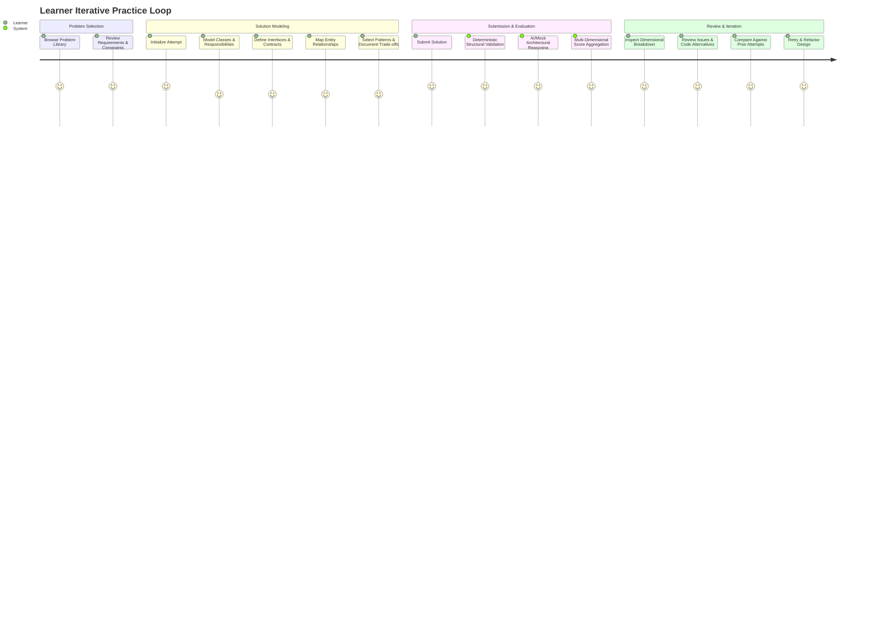
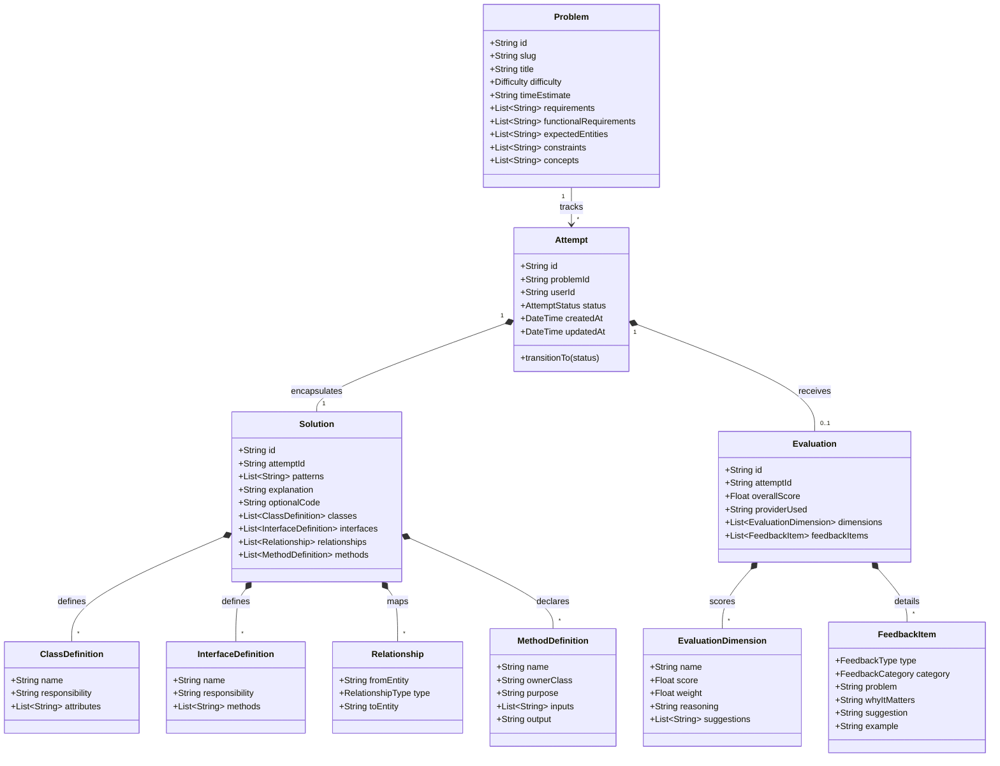

# Low-Level Design (LLD) Platform: System Architecture & Design Document

## 1. MVP Scope & Goals

The LLD Practice Platform provides an interactive environment where software engineers can practice Object-Oriented Low-Level Design, submit structured architectural specifications, receive explainable multi-dimensional evaluations, inspect past attempts, and iteratively improve.

### Primary Objectives
- Transform LLD practice from passive reading or unstructured coding into an active, iterative modeling exercise.
- Provide explainable, multi-dimensional feedback (Problem $\rightarrow$ Why it matters $\rightarrow$ Actionable suggestion $\rightarrow$ Code/interface alternative).
- Demonstrate rigorous software engineering principles (SOLID, Strategy Pattern, Repository Pattern, Dependency Inversion) in the platform's own codebase.
- Provide reliable zero-external-dependency execution via `MockEvaluationProvider`, with optional `LLMEvaluationProvider` capability.

---

## 2. Core User Journey



---

## 3. Domain Model & Class Diagram

The domain model is structured around Clean Architecture principles, ensuring persistence technologies (Prisma/SQLite/PostgreSQL) and external AI APIs remain outer-layer concerns.



---

## 4. Key Interfaces & Abstractions

### Evaluation Interfaces (`server/src/evaluation/Evaluator.ts`)
```typescript
export interface RuleResult {
  passed: boolean;
  ruleName: string;
  category: 'STRUCTURAL' | 'COHESION' | 'RELATIONSHIPS' | 'ENTITIES';
  severity: 'CRITICAL' | 'WARNING' | 'INFO';
  message: string;
  details?: Record<string, unknown>;
}

export interface EvaluationRule {
  readonly name: string;
  evaluate(solution: Solution, problem: Problem): RuleResult;
}

export interface EvaluationInput {
  problem: Problem;
  solution: Solution;
  deterministicFindings: RuleResult[];
}

export interface EvaluationResult {
  providerId: string;
  overallScore: number;
  dimensions: EvaluationDimensionResult[];
  strengths: string[];
  issues: FeedbackItemResult[];
}

export interface EvaluationProvider {
  readonly providerId: string;
  evaluate(input: EvaluationInput): Promise<EvaluationResult>;
}
```

### Repositories (`server/src/repositories/`)
- `IProblemRepository`: `findAll()`, `findById(id)`, `findBySlug(slug)`.
- `IAttemptRepository`: `create(attempt)`, `findById(id)`, `findByProblemId(problemId)`, `update(attempt)`.
- `IEvaluationRepository`: `save(evaluation)`, `findByAttemptId(attemptId)`.

---

## 5. Evaluation Architecture & Pipeline

The evaluation pipeline guarantees determinism before reasoning:

```
                  ┌──────────────────────┐
                  │   Learner Solution   │
                  └──────────┬───────────┘
                             │
                             ▼
              ┌──────────────────────────────┐
              │  Phase 1: Deterministic      │
              │  Rules Engine                │
              │  - DuplicateEntityRule       │
              │  - DanglingRelationshipRule  │
              │  - MissingCoreEntityRule     │
              │  - OrphanMethodRule          │
              │  - EmptyResponsibilityRule   │
              └──────────────┬───────────────┘
                             │
                             ▼
              ┌──────────────────────────────┐
              │  Phase 2: EvaluationProvider │
              │  Strategy                    │
              │  ┌────────────────────────┐  │
              │  │ MockEvaluationProvider │  │ (Realistic heuristic LLD engine)
              │  └────────────────────────┘  │
              │               OR             │
              │  ┌────────────────────────┐  │
              │  │  LLMEvaluationProvider │  │ (OpenAI/Gemini with strict JSON schema)
              │  └────────────────────────┘  │
              └──────────────┬───────────────┘
                             │
                             ▼
              ┌──────────────────────────────┐
              │  Phase 3: Weighted Dimension │
              │  Aggregator & Assembler      │
              └──────────────┬───────────────┘
                             │
                             ▼
                  ┌──────────────────────┐
                  │ Persisted Evaluation │
                  └──────────────────────┘
```

---

## 6. Deterministic vs. AI Evaluation Matrix

| Category | Checked By | Rationale & Examples |
| :--- | :--- | :--- |
| **Referential Integrity** | Deterministic Engine | A relationship specifies `from: Car` to `to: SpotTracker`, but `SpotTracker` was never declared. 100% deterministic graph check. |
| **Entity Uniqueness** | Deterministic Engine | Duplicate definitions for `ParkingSpot` with conflicting responsibilities. |
| **Required Domain Entities** | Deterministic Engine | A Parking Lot submission with no `Vehicle`, `Spot`, or `Ticket` classes fails baseline problem coverage. |
| **Cohesion & God Classes** | AI / Mock Provider | A `ParkingLot` class with 8 responsibilities (payment, slot lookup, printing, entrance gates, rate calculation) violates SRP. |
| **Abstraction & Interfaces** | AI / Mock Provider | Fee calculation hardcoded without a `PricingStrategy` interface, preventing extension for weekend or VIP rates. |
| **Design Patterns & Trade-offs**| AI / Mock Provider | Misuse of Singleton for entities that should have multiple instances, or lack of Factory for vehicle creation. |

---

## 7. Scoring Model

Scoring is transparent and weighted across 6 explicit dimensions:

```typescript
export const DEFAULT_DIMENSION_WEIGHTS = {
  STRUCTURAL: 0.20,      // Basic entity presence & relationship graph validity
  RESPONSIBILITY: 0.20,  // Single Responsibility Principle, Cohesion
  ABSTRACTION: 0.15,     // Interface segregation, loose coupling
  RELATIONSHIPS: 0.15,   // Appropriate use of Composition vs Inheritance
  EXTENSIBILITY: 0.15,   // Open/Closed principle, ease of adding requirements
  PATTERNS: 0.15,        // Appropriate pattern choices and rationale
};
```

---

## 8. Failure Handling & Resilience

1. **Deterministic Rule Failures**: Even if a solution has critical flaws (e.g., missing entities, dangling links), the attempt is **not** aborted. Instead, the deterministic findings are mapped directly into high-severity `FeedbackItem` entries (`CRITICAL`), reducing the structural score transparently while allowing the learner to see what went wrong.
2. **Provider Failures**: If an external LLM call times out, returns malformed JSON, or rejects the API key:
   - The attempt status is marked as `FAILED` with an informative error message.
   - The learner's design is **never lost**.
   - The user can click "Retry Evaluation" on the UI.
   - If configured with fallback, the system seamlessly falls back to `MockEvaluationProvider` so the learner demo never breaks.
3. **Draft Preservation**: As the learner types in the Practice Workspace, state is tracked locally and autosaved to avoid accidental loss.

---

## 9. Extensibility

The architecture facilitates straightforward expansion without touching core domain models:
- **New Evaluation Providers**: Implement the `EvaluationProvider` interface and register it in `EvaluationService`.
- **New Problem Domains**: Seed additional problems via JSON definitions or Prisma migrations.
- **Alternative Submission Formats**: Currently, the platform ingests structured entity JSON. To support Mermaid class diagrams or UML PlantUML text in the future, introduce a `MermaidSubmissionParser implements ISubmissionParser` that parses Mermaid text into the existing `Solution` entity.

---

## 10. Key Engineering Trade-offs

1. **SQLite vs. PostgreSQL**: Used SQLite by default for zero-friction setup without requiring local PostgreSQL services. Kept schema 100% Prisma-compliant so switching to PostgreSQL requires only modifying `provider = "postgresql"` and `DATABASE_URL`.
2. **Synchronous Evaluation**: Handled evaluation within the HTTP request lifecycle rather than a distributed message queue (BullMQ/RabbitMQ). This simplifies local testing and eliminates external infrastructure dependencies while using an async-ready state machine on `Attempt`.
3. **Structured Form vs. Code AST**: A structured entity form was selected over writing raw TypeScript/Java classes. This keeps the learner focused on architecture rather than syntax and compiles directly into a verifiable domain graph.

---

## 11. What Was Intentionally NOT Built (Non-Goals)

- Complex multi-tenant RBAC / OAuth (replaced by a simple demo user model).
- Distributed microservices, Kubernetes manifests, or Kafka event streams.
- Full code compilation/execution sandbox (OOD is about design structure, not running CPU loops).
- Real-time collaborative whiteboard drawing.

---

## 12. Future Improvements

1. Canvas/UML interactive visual diagram drag-and-drop generator synced bi-directionally with the structured entity form.
2. Historical attempt diff viewer showing side-by-side design evolution (e.g. diffing Attempt 1 vs. Attempt 2).
3. Asynchronous evaluation worker with WebSockets for long-running LLM reasoning chains.
